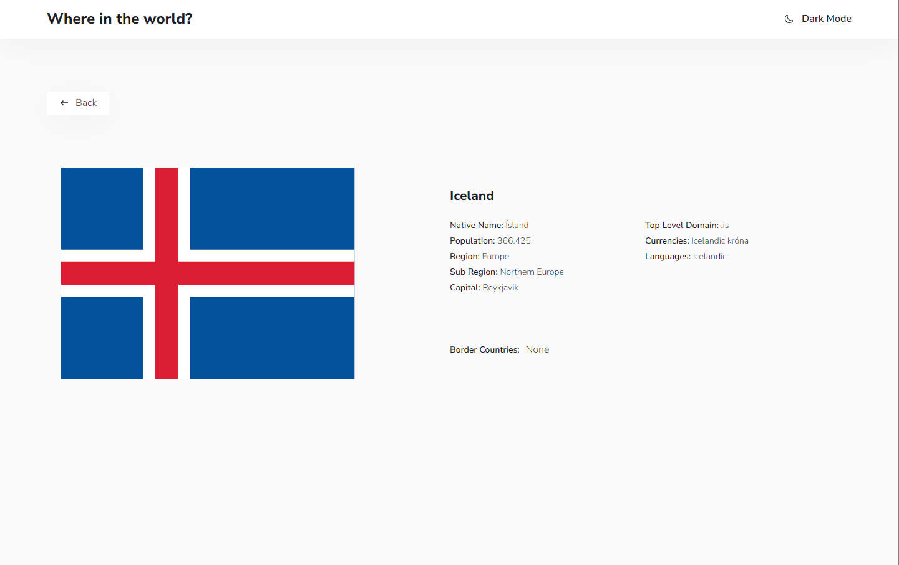

# Frontend Mentor - REST Countries API with color theme switcher solution

This is a solution to the [REST Countries API with color theme switcher challenge on Frontend Mentor](https://www.frontendmentor.io/challenges/rest-countries-api-with-color-theme-switcher-5cacc469fec04111f7b848ca). Frontend Mentor challenges help you improve your coding skills by building realistic projects.

## Table of contents

- [Overview](#overview)
  - [The challenge](#the-challenge)
  - [Screenshots](#screenshots)
- [My process](#my-process)
  - [Built with](#built-with)
- [Author](#author)

## Overview

### The challenge

Users should be able to:

- See all countries from the API on the homepage
- Search for a country using an `input` field
- Filter countries by region
- Click on a country to see more detailed information on a separate page
- Click through to the border countries on the detail page
- Toggle the color scheme between light and dark mode _(optional)_

### Screenshots

| Light Theme                                               | Dark Theme                                              |
| --------------------------------------------------------- | ------------------------------------------------------- |
|             |             |
|        |        |
|       |       |
|  |  |

## My process

### Built with

- [React](https://reactjs.org/)
- [React Router](https://reactrouter.com/en/main) For routing
- [React Query](https://tanstack.com/query/v3/) For remote state management
- [react-icons](https://react-icons.github.io/react-icons/) - For icons
- [Sass](https://sass-lang.com/) - For styles

## Author

- Frontend Mentor - [@Dogukanays](https://www.frontendmentor.io/profile/yourusername)
- Linkedin - [@dogukan-aysan](https://www.linkedin.com/in/dogukan-aysan/)
- Email - <dogukanaysan01@gmail.com>
